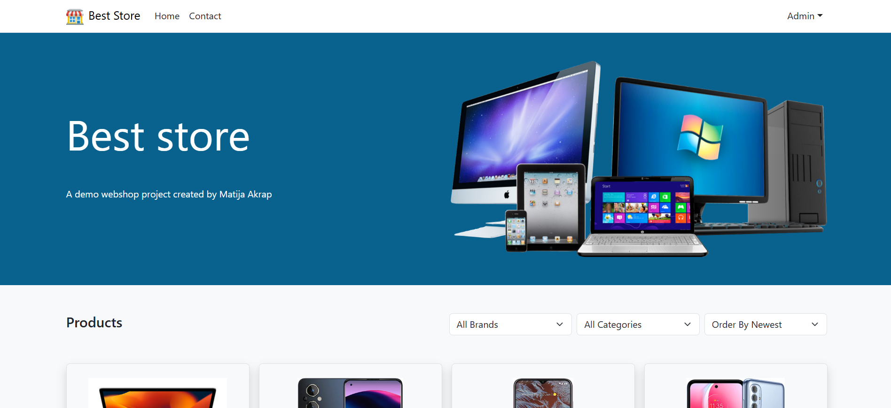

<a id="readme-top"></a>
[![Contributors][contributors-shield]][contributors-url]
[![Forks][forks-shield]][forks-url]
[![Stargazers][stars-shield]][stars-url]
[![Issues][issues-shield]][issues-url]
[![Unlicense License][license-shield]][license-url]
[![LinkedIn][linkedin-shield]][linkedin-url]

<br />
<div align="center">
  <a href="https://github.com/ma55530/best-store">
    
  </a>

  <h3 align="center">Best Store</h3>

  <p align="center">
    E-commerce web app made with React.
    <br />
    <a href="https://ma55530.github.io/best-store/"><strong>Explore the docs »</strong></a>
    <br />
    <br />
    <a href="https://ma55530.github.io/best-store/">View Demo</a>
    ·
    <a href="https://github.com/ma55530/best-store/issues/new?labels=bug&template=bug-report---.md">Report Bug</a>
    ·
    <a href="https://github.com/ma55530/best-store/issues/new?labels=enhancement&template=feature-request---.md">Request Feature</a>
  </p>
</div>

<details>
  <summary>Table of Contents</summary>
  <ol>
    <li>
      <a href="#about-the-project">About The Project</a>
      <ul>
        <li><a href="#built-with">Built With</a></li>
      </ul>
    </li>
    <li>
      <a href="#getting-started">Getting Started</a>
      <ul>
        <li><a href="#prerequisites">Prerequisites</a></li>
        <li><a href="#installation">Installation</a></li>
        <li><a href="#full-setup-guide-react--json-server">Full Setup Guide (React + JSON Server)</a></li>
      </ul>
    </li>
    <li><a href="#usage">Usage</a></li>
    <li><a href="#roadmap">Roadmap</a></li>
    <li><a href="#contributing">Contributing</a></li>
    <li><a href="#license">License</a></li>
    <li><a href="#contact">Contact</a></li>
    <li><a href="#acknowledgments">Acknowledgments</a></li>
  </ol>
</details>

## About The Project

[![product-screenshot]](https://ma55530.github.io/best-store/)

Best Store is an e-commerce web application built in React that simulates an online store.

Main features:
* Product Display: Showcases products organized by categories with sorting functionalities.
* User Authentication: Allows users to register, log in, and update their personal information.
* Product Management: Enables administrators to add, edit, and delete products.
* User Management: Provides administrators with a list of users and their data, excluding passwords.
* Product Details: Displays detailed information about each product.

<p align="right">(<a href="#readme-top">back to top</a>)</p>

### Built With

* [React](https://reactjs.org/)
* [React Router](https://reactrouter.com/)
* [React Icons](https://react-icons.github.io/react-icons/)
* [CSS Modules](https://github.com/css-modules/css-modules)
* [GitHub Pages](https://pages.github.com/)

<p align="right">(<a href="#readme-top">back to top</a>)</p>

## Getting Started

Follow these steps to run the project locally.

### Prerequisites

* npm
    ```sh
    npm install npm@latest -g
    ```

### Installation

1.  Clone the repository
    ```sh
    git clone https://github.com/ma55530/best-store.git
    ```
2.  Install NPM packages
    ```sh
    npm install
    ```
3.  Start the server
    ```sh
    npm start
    ```
4.  Create a build directory with a production build of your app
    ```sh
    npm run build
    ```
5. Deploy the site
    ```sh
    npm run deploy
    ```

### Full Setup Guide (React + JSON Server)

If you want to set up your own React application and configure a local JSON server for the backend, follow these steps:

#### Step 1: Install Node.js

Check if Node.js is installed:

```bash
node --version
```

If you see a version number, Node.js is already installed. If not, download it from the [official Node.js website](https://nodejs.org/) and install it.

#### Step 2: Create a New React Application

Run in the terminal:

```bash
npx create-react-app my-app
```

Replace `my-app` with the name of your application. After the process is complete:

```bash
cd my-app
```

#### Step 3: Set Up the Backend Folder

In the main React project folder, create a new folder:

```bash
mkdir backend
cd backend
```

#### Step 4: Install JSON Server

In the `backend` folder, install the JSON Server:

```bash
npm install json-server
```

#### Step 5: Create `db.json`

Create a new `db.json` file in the `backend` folder with the sample data:

```json
{
  "products": [
    { "id": 1, "name": "Product 1", "price": 100 },
    { "id": 2, "name": "Product 2", "price": 200 }
  ]
}
```

#### Step 6: Start JSON Server

Start the server using the command line:

```bash
npx json-server --watch db.json --port 3000
```

The server will be available at `http://localhost:3000/products`.

#### Step 7: Run the React App

In another terminal (from the main directory of the app):

```bash
npm start
```

Now you can communicate with the JSON server using the function fetch, ex. `fetch("http://localhost:3000/products")`.

<p align="right">(<a href="#readme-top">back to top</a>)</p>

## Usage

Visit [https://ma55530.github.io/best-store/](https://ma55530.github.io/best-store/) to see the live demo of the appaplikacij.

<p align="right">(<a href="#readme-top">back to top</a>)</p>

## Roadmap

See [open issues](https://github.com/ma55530/best-store/issues) for a list of suggested features and known issues.

<p align="right">(<a href="#readme-top">back to top</a>)</p>

## Additional Resources

-  [json-server-auth](https://www.npmjs.com/package/json-server-auth?activeTab=readme): Koristan dodatak za autentikaciju korisnika u JSON Server okruženju.
-  [multer](https://www.npmjs.com/package/multer): Middleware for handling `multipart/form-data` which is used to upload files in Express applications.

## Contribute

If you have a suggestion to improve this, please fork the repository and create a pull request. You can also simply open an issue with the tag "enhancement".

Don't forget to star the project! Thanks again!

1.  Fork the Project  
2.  Create your Feature Branch (`git checkout -b feature/AmazingFeature`)  
3.  Commit your Changes (`git commit -m 'Add some AmazingFeature'`)  
4.  Push to the Branch (`git push origin feature/AmazingFeature`)  
5.  Open a Pull Request  

### Author

<a href="https://github.com/ma55530/best-store/graphs/contributors">
  
</a>

<p align="right">(<a href="#readme-top">back to top</a>)</p>

## License

Distributed under the Unlicense License. See `LICENSE.txt` for more information.

<p align="right">(<a href="#readme-top">back to top</a>)</p>

## Contact

Matija Akrap - [ma55530](https://github.com/ma55530) - matija.akrap009@gmail.com

Project Link: [https://github.com/ma55530/best-store](https://github.com/ma55530/best-store)

<p align="right">(<a href="#readme-top">back to top</a>)</p>

## Acknowledgments

* [Udemy - Build Complete E-Commerce React Application](https://www.udemy.com/course/build-complete-react-application/?couponCode=ST13MT80425G1)
* [GitHub Pages](https://pages.github.com)
* [React Icons](https://react-icons.github.io/react-icons/search)


<p align="right">(<a href="#readme-top">back to top</a>)</p>


<p align="right">(<a href="#readme-top">back to top</a>)</p>

[contributors-shield]: https://img.shields.io/github/contributors/ma55530/best-store.svg?style=for-the-badge
[contributors-url]: https://github.com/ma55530/best-store/graphs/contributors
[forks-shield]: https://img.shields.io/github/forks/ma55530/best-store.svg?style=for-the-badge
[forks-url]: https://github.com/ma55530/best-store/network/members
[stars-shield]: https://img.shields.io/github/stars/ma55530/best-store.svg?style=for-the-badge
[stars-url]: https://github.com/ma55530/best-store/stargazers
[issues-shield]: https://img.shields.io/github/issues/ma55530/best-store.svg?style=for-the-badge
[issues-url]: https://github.com/ma55530/best-store/issues
[license-shield]: https://img.shields.io/github/license/ma55530/best-store.svg?style=for-the-badge
[license-url]: https://github.com/ma55530/best-store/blob/master/LICENSE.txt
[linkedin-shield]: https://img.shields.io/badge/-LinkedIn-black.svg?style=for-the-badge&logo=linkedin&colorB=555
[linkedin-url]: https://www.linkedin.com/in/matija-akrap-0837ab176/
[product-screenshot]: images/screenshot.png
